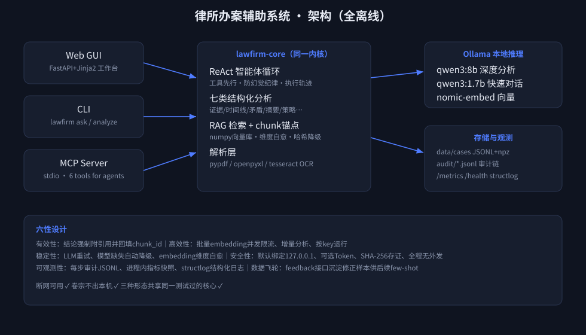

# 律所办案辅助系统 · LawFirm AI Copilot

**全离线本地大模型驱动**的刑事案件卷宗分析平台。卷宗数据不出本机。



## ✨ 核心能力

| 模块 | 说明 |
|---|---|
| 📁 案件工作台 | 新建案件自动生成表单；上传 PDF / 扫描卷宗(OCR) / Excel银行流水 |
| 🔍 七类结构化分析 | 证据要点(书证/物证/言词)、案件时间线、矛盾排查(高危/中风险分级)、无效材料过滤、卷宗摘要、庭审思路、银行流水专项 |
| 🎯 原文溯源 | 每条结论附引用，点击跳回原卷宗页码位置（chunk级锚点） |
| 🤖 ReAct AI助手 | 上下文锁定当前页面；自主规划调用工具(检索/读原文/取分析/流水统计)；完整执行轨迹+审计日志 |
| ⚙️ 双模型路由 | 深度分析用高算力模型(qwen3:8b)，快速对话用轻量模型(qwen3:1.7b)，设置页可视切换状态 |
| ⚖️ 量刑建议 | 确定性法条引擎：6罪名档位判定+情节调节（认罪认罚/自首/退赃等7种），输出基准刑与调整后区间，附免责声明 |
| 🔄 数据飞轮 | `/api/cases/{id}/feedback` 沉淀修正语料，越用越准 |

## ️ 三种形态（同一内核）

```bash
lawfirm serve              # Web GUI + REST API
lawfirm ask "本案矛盾点?" --case-id xxx   # CLI
lawfirm mcp                # MCP stdio server，供任意智能体接入
```

MCP 暴露工具：`cases_list / case_detail / case_analyses / analyze_key / search_case_files / ask_assistant`

## 🚀 快速开始

```bash
# 1. Ollama（二进制发布包或官方脚本）
ollama serve
ollama pull qwen3:8b && ollama pull qwen3:1.7b && ollama pull nomic-embed-text:v1.5

# 2. 本项目（Python ≥3.12, uv 管理）
uv venv && uv pip install -e .

# 3. 起服务
lawfirm serve            # http://127.0.0.1:8000
```

## 🏗️ 架构

```
src/lawfirm/
├── config.py        # pydantic-settings，环境变量前缀 LAWFIRM_*
├── llm.py           # Ollama客户端：双模型路由/JSON模式/重试/embedding降级
├── observe.py       # structlog JSON日志 + 进程内指标 + JSONL审计链
├── rag/             # store(案件存储) parsing(PDF/Excel/OCR) retrieval(向量检索+锚点)
├── analysis/        # 七类报告 prompt工程 + 引用锚点回填
├── agents/          # ReAct循环 + 5个离线工具
├── api/server.py    # FastAPI：REST + 安全门 + /metrics + /audit
├── web/             # Jinja2服务端渲染GUI（零构建）
├── cli/main.py      # Typer CLI
└── mcp_server/      # MCP stdio server (FastMCP)
```

## 🔒 六性设计

- **有效性**：所有结论强制附 citations；quote 原文匹配回填 chunk_id，杜绝无源结论
- **高效性**：embedding 批量并发+信号量限流；numpy 内存向量库零服务依赖；分析按 key 增量运行
- **稳定性**：LLM 调用自动重试；embedding 不可用时降级哈希向量；单文档解析失败不阻断整案
- **安全性**：默认仅绑定 127.0.0.1；可选 X-API-Token 网关；上传白名单+大小限制+SHA-256存证；全程离线无外发
- **可观测性**：**`/dashboard` 实时面板**（健康/LLM调用/耗时分布/事件统计/审计流水账，5s自刷新）、`/api/metrics`、`/api/audit/history?event=`(跨日检索+事件过滤)、structlog JSON 日志
- **数据飞轮**：反馈接口沉淀修正样本 → 后续 few-shot 检索复用

## 📊 演示数据

内置示例案件「张某某涉嫌非法吸收公众存款案」：起诉意见书 + 司法会计鉴定（含故意埋设的时间矛盾：供述2021年6月 vs 鉴定2021年3月资金入账）+ 无关物业催缴单，用于展示矛盾排查与无效材料过滤。

## License / 课程信息

2627s1 人工智能导论 IAI 项目 · 仅供教学演示
